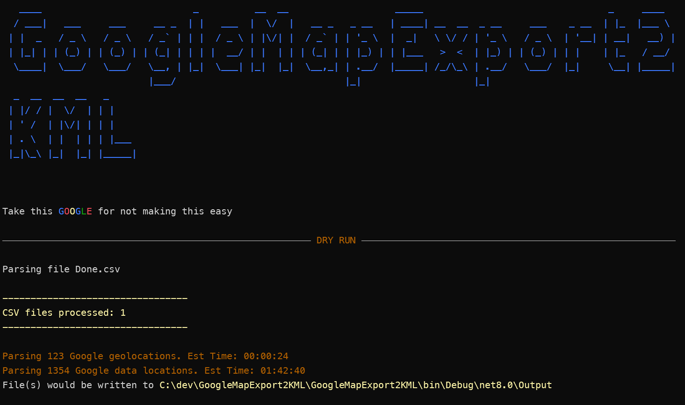
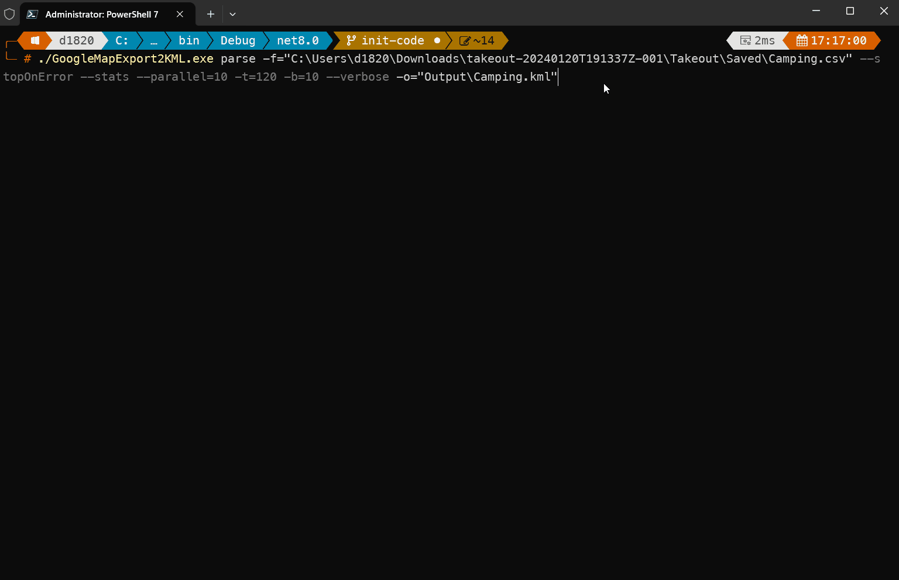

# GoogleMapExport2KML

Parses .csv files generated from a google maps export of Saved Places. This fills the gpa of allowing you to import valid KML files from google maps into other mapping applications.


## Usage

- Export your data from [Google Takeout](https://takeout.google.com)
- Install this dotnet tool (DanTurco.GoogleMapExport2Kml) from [Nuget](https://www.nuget.org/) ```dotnet tool install DanTurco.GoogleMapExport2Kml --global```
- Run commands to output your KML file. See below for command options and usage
    - ```goog2kml parse [OPTIONS]```


#### Options

| Short Command | Long Command      | Description                                                                                                    |
| ------------- | ----------------- | -------------------------------------------------------------------------------------------------------------- |
| -h,           | --help            | Prints help information                                                                                        |
| -v,           | --version         | Prints version information                                                                                     |
|               | --noheader        | If true. Does not display the banner on command execute                                                        |
| -f,           | --file            | The csv files to parse                                                                                         |
|               | --includeComments | If true. Adds any comment from the csv column to the description                                               |
| -v,           | --verbose         | If true. Increases the level of the output                                                                     |
| -s,           | --stats           | If true. Outputs all the timing stats                                                                          |
| -o,           | --output          | The output KML file                                                                                            |
| -t,           | --timeout         | The timeout to wait on each lookup for coordinates from Google. Default 10s                                    |
| -p,           | --parallel        | The number of threads used to process Google data locations. Default 4                                         |
|               | --stopOnError     | If true. Stops parsing on any csv row error                                                                    |
|               | --dryrun          | If true. Runs through the files and estimates times to completion                                              |
| -c,           | --chunks          | The number of placements to add per KML file. Files will be named based on number of files needed. Default ALL |

#### Example Commands

```powershell
# Typical command
goog2kml parse -f=C:\downloads\myplaces.csv -f=C:\downloads\myfavoriteplaces.csv
-o=MyCombinedPlaces.kml --stats --stopOnError -p=10
```

```powershell
# This will output an estimated time that it will take to complete the conversion
goog2kml parse -f=C:\downloads\myplaces.csv -f=C:\downloads\myfavoriteplaces.csv
-o=MyCombinedPlaces.kml --dryrun
```

```powershell
# Creates multiple output files with 500 placemarks per file. This is useful for mapping
# applications that limit the amount of placemarks that can be imported at 1 time
goog2kml parse -f=C:\downloads\myplaces.csv -f=C:\downloads\myfavoriteplaces.csv
-o=MyCombinedPlaces.kml -c=500
```

```powershell
# Outputs all the lines and files being processed. Once all completed will output how much time
# each section took to complete
goog2kml parse -f=C:\downloads\myplaces.csv -f=C:\downloads\myfavoriteplaces.csv
-o=MyCombinedPlaces.kml --stats --verbose
```

```powershell
# Processes all the Google places lookups in parallel of 10 at a time. Note the more parallelism
# used the more load is placed on your computer
goog2kml parse -f=C:\downloads\myplaces.csv -f=C:\downloads\myfavoriteplaces.csv
-o=MyCombinedPlaces.kml -p=10
```


## Errors and Solutions

### Error: Index was out of range


#### Solution

- Increase the timeout for looking up the place in Google. The default is 10s and that is usually enough time, but if google has congestion this could impact lookup time.
- Run the job over again

#### Screenshots

##### Typical Run


##### Dry Run



##### Verbose



## Sample CSV File

```text
Title,Note,URL,Comment
Dropped pin,,"https://www.google.com/maps/search/34.3948012,-111.1521886",
"39°42'51.2""N 106°09'53.8""W",,"https://www.google.com/maps/search/39.714212,-106.164947",
"39°43'00.7""N 106°09'41.6""W",,"https://www.google.com/maps/search/39.716858,-106.16156",
"39°43'05.2""N 106°09'19.0""W",,"https://www.google.com/maps/search/39.718111,-106.155271",
Pine Cove Campground,24/night FF,https://www.google.com/maps/place/Pine+Cove+Campground/data=!4m2!3m1!1s0x876a5eaa342bd02d:0xcabf37436295da63,
Clear Creek Reservoir Campground,,https://www.google.com/maps/place/Clear+Creek+Reservoir+Campground/data=!4m2!3m1!1s0x876aba47279efd93:0x38cdc8f3e4649fad,
```

## Sample KML File

```xml
<?xml version="1.0" encoding="utf-8"?>
<kml xmlns:xsi="http://www.w3.org/2001/XMLSchema-instance" xmlns:xsd="http://www.w3.org/2001/XMLSchema" xmlns="http://www.opengis.net/kml/2.50">
  <Document>
    <name>Camping</name>
    <Placemark>
      <description />
      <name>Dropped pin</name>
      <Point>
        <coordinates>34.3948012,-111.1521886</coordinates>
      </Point>
    </Placemark>
    <Placemark>
      <description />
      <name>Dropped pin</name>
      <Point>
        <coordinates>34.3754296,-111.1464524</coordinates>
      </Point>
    </Placemark>
    <Placemark>
      <description />
      <name>Dropped pin</name>
      <Point>
        <coordinates>34.3425726,-110.9879697</coordinates>
      </Point>
    </Placemark>
  </Document>
</kml>
```

## Technical Notes

Under this covers this uses Selenium to lookup the translation from Google place to Latitude and Longitude.
Becuase of this we are sometimes at the mercy of your internet connection and Google web throttling. 
Attempts are made to recover from these errors but sometimes may result in a crash of the tool.

## Changelog

| Date       | Change                                   | Version |
| ---------- | ---------------------------------------- | ------- |
| 02/03/2024 | Add support to convert Google CSV to KML | 1.0     |
